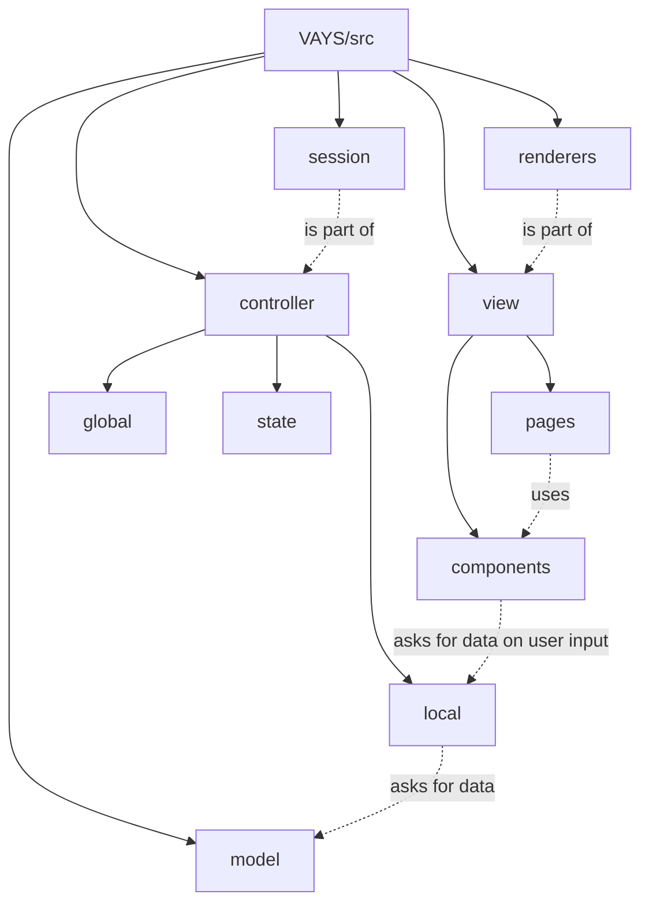

# Architecture

VAYS is structured along an **MVC** split that is common in frontend
design: the **model** owns the data, the **controller** decides *what*
to display, and the **view** decides *how* to display it.

## Model

The data layer — what the app knows about "reality". This is the only
part that talks to YAC and, transitively, the CMDB. Its modules
mirror the YAC API: one module per call, each handling that call's
return cases and any caching the response needs.

## Controller

The decision layer. It takes data from the model and tells the view
what to show; when the user submits something, it hands the payload
back to the model in a shape the model understands (not necessarily
the API shape — the model translates).

Controllers are organised by GUI component:

  - **Local** controllers are tied to a single page or component.
  - **Global** controllers have no such scope and can be reached from
    anywhere.

The controller also owns the app's **state**. Convention: only the
controller module that owns a piece of state reads or writes it
directly. Everything else goes through getters/setters that the
controller exposes.

## View

The presentation layer — React components and renderers. The
controller has already decided *what* to display; the view is only
concerned with *how*.

## Module Map

Subfolders of `src/` and how they reach each other. Solid edges are
subfolder relationships; dashed edges are import relationships.
`renderers` and `session` are sibling folders under `src/` but
logically belong to `view` and `controller` respectively (labelled
*is part of*).

