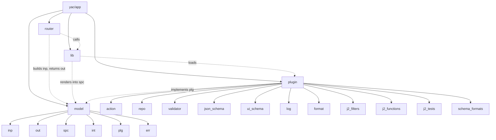

# Architecture

YAC is a FastAPI service that turns a single YAML config — the
**specs** file — into a REST API for managing many similar YAML
files in a Git repository. Each request re-renders the specs in the
caller's context, evaluates roles against that rendering, and (for
writes) hands a diff to a pluggable repo backend.

`app/` is the application code. It splits along four axes — what
enters the process, what leaves it, the logic in between, and the
seams where users plug in their own code.

## Router

The HTTP layer. One module per operation kind (`read`, `create`,
`edit`, `delete`, `arbitrary`, `validate`, `status`, `error`). A
router parses URL, headers and body, packs them — together with the
authenticated user — into an `OperationRequest`, and orchestrates
calls into `lib/`. Routers contain no business logic of their own;
they're the part FastAPI sees.

## Model

Pydantic models, partitioned by direction. The convention is strict:
a module imports only from the directions it actually faces.

  - `inp` — HTTP request shapes (`OperationRequest`, `NewEntity`,
    `UpdateEntity`, ...).
  - `out` — HTTP response shapes (`User`, `Permission`,
    `DetailedEntity`, ...).
  - `spc` — the parsed specs file (`Specs`, `Type`, `Role`, ...).
  - `int` — internal in-process shapes that never cross the API
    (`Entity`).
  - `plg` — abstract plugin interfaces (`IRepo`, `IValidator`,
    `IJsonSchema`, ...).
  - `err` — exception hierarchy. Each `lib/` module declares the
    errors it raises in its docstring.

## Lib

Business logic. Each module owns one concern and is stateless apart
from explicit caches (`lib/cache.py` provides an async LRU+TTL keyed
on a caller-supplied projection).

The hot path is always the same:

  1. **Resolve** — `lib/specs.py` re-renders the YAML specs for this
     request through Jinja2 (`lib/j2.py`), scoping user/request data
     via `lib/props.py`. `lib/repo.py` fetches the old (and, for
     writes, new) entity state from the repository.
  2. **Authorize** — `lib/perms.py` walks the rendered `roles` block,
     pre-filters the user-only role tests once per request, and
     resolves the remaining entity-dependent halves to a permission
     set.
  3. **Validate** — `lib/validator.py` runs the validator plugins in
     two passes (`test_always` for list endpoints, `test_nolist` for
     single-entity endpoints). For writes, `lib/schema.py` walks the
     JSON Schema, runs the JSON Schema / UI Schema plugins, and
     validates the new data.
  4. **Side-effects** — write operations open a `repo.handler.writer`
     scope, commit the diff, and dispatch any configured actions
     through `lib/action.py`. Logs (`lib/log.py`) are fetched on
     demand.

`lib/auth.py` (OIDC), `lib/yaml.py` (parse/update) and `lib/locs.py`
(JSON Schema traversal) are utilities reused across the pipeline.

## Plugin

Every extension point is a plugin folder under `app/plugin/{kind}`.
The loader (`lib/plugin.py`) walks each folder at startup and exposes
three lookups:

  - `get_module(kind, name)` — pick one by name. Used where the specs
    name a single plugin (`repo.plugin`, `YAC_FORMAT_PLUGIN`, per-type
    `logs[].plugin` and `actions[].plugin`).
  - `get_sorted(kind, varname)` — get all of a kind in a defined
    order. Used where many plugins compose: `json_schema` and
    `ui_schema` processors that walk the schema tree, `validator`
    plugins.
  - `get_functions(kind)` — gather function-style plugins by name.
    Used by `j2_filters`, `j2_functions`, `j2_tests` and
    `schema_formats`.

Plugin contracts live in `model/plg.py`. To add a new kind, drop a
folder, add an interface, and call the loader from the consumer.

## Specs are the API

The specs file is read once at process startup, but every block that
can reference per-request state (`types`, `roles`, `json_schema`,
`sets`, `request`) is re-rendered per request with the caller's
identity and data. That is what makes YAC declarative: roles,
schemas, and even the entity name pattern can be conditional on the
user, request headers, or the existing entity data. The cost is
amortised by request-scoped caches keyed on a stable signature of
the rendered inputs.

`auth` and `repo.plugin` / `repo.connection` are the exceptions —
they are read once at import and frozen for the lifetime of the
process. Changing them requires a restart.

## Module Map

Subfolders of `app/` and how they reach each other. Solid edges are
subfolder relationships; dashed edges are import relationships.

